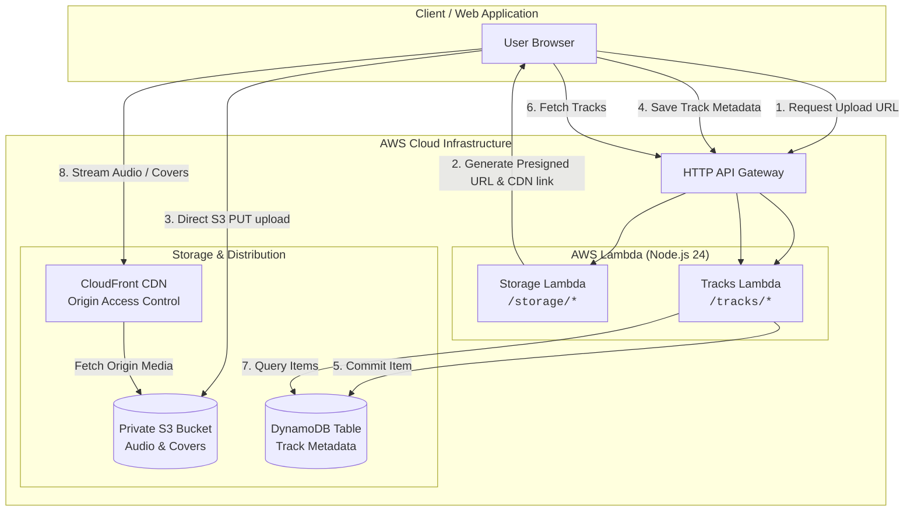

# Playlist Backend API

[](https://nodejs.org)
[](https://www.typescriptlang.org)
[](https://expressjs.com)
[](https://aws.amazon.com/lambda/)
[](https://aws.amazon.com/dynamodb/)
[](https://aws.amazon.com/cloudfront/)
[](https://vitest.dev)
[](https://opensource.org/licenses/ISC)

A high-performance, event-driven serverless backend for the Playlist web application. Built with **TypeScript (NodeNext ESM)**, **Express 5**, and **Serverless Framework v4**, this service manages track metadata persistence, presigned direct-to-S3 media ingestion, and global audio streaming via Amazon CloudFront.

---

## Table of Contents

- [Overview](#overview)
- [Key Features & Benefits](#key-features--benefits)
- [Architecture & Data Flow](#architecture--data-flow)
- [Project Structure](#project-structure)
- [API Quick Reference](#api-quick-reference)
  - [Storage Domain (`/storage`)](#storage-domain-storage)
  - [Tracks Domain (`/tracks`)](#tracks-domain-tracks)
- [Getting Started](#getting-started)
  - [Prerequisites](#prerequisites)
  - [Installation](#installation)
  - [Environment Configuration](#environment-configuration)
  - [Local Development](#local-development)
  - [Running Tests & Type Checking](#running-tests--type-checking)
  - [Deployment](#deployment)
- [Contributing](#contributing)
- [Support & Resources](#support--resources)
- [License](#license)

---

## Overview

`playlist-backend` serves as the core API service powering music playback and asset management for the Playlist platform. It solves standard media streaming bottlenecks by offloading large binary transfers directly to object storage via presigned URLs and distributing media files at low latency across edge locations via Amazon CloudFront.

The application executes as decoupled AWS Lambda functions behind AWS HTTP API Gateway with a $0 idle-cost model running within the AWS Free Tier.

---

## Key Features & Benefits

- **Direct-to-S3 Presigned Ingestion:** Generates short-lived, signed S3 `PUT` URLs to upload audio tracks (`.mp3`) and cover artwork (`.png`) directly from the browser, preventing server memory spikes and eliminating API Gateway 10MB payload limitations.
- **Edge Media Delivery (CloudFront + OAC):** Audio and image assets are served securely through CloudFront CDN using Origin Access Control (OAC), keeping the underlying S3 bucket completely private while enabling global edge caching.
- **Sub-10ms Metadata Persistence:** Powered by Amazon DynamoDB with single-table design and `PAY_PER_REQUEST` on-demand billing for predictable performance and zero baseline compute cost.
- **Express 5 & Native Async Handling:** Uses Express 5 with built-in Promise rejection handling wrapped in `serverless-http` for lightweight, containerless execution on Node.js 24 (`nodejs24.x`).
- **Strict Schema Validation & Type Safety:** Runtime input validation with Zod schemas and compile-time TypeScript type inference across all endpoints and database operations.
- **Comprehensive Test Suite:** 100% unit and integration test pass rate powered by Vitest, mocking AWS SDK v3 clients with zero external network overhead.

---

## Architecture & Data Flow



---

## Project Structure

The project follows a modular, domain-driven structure decoupling routes, controllers, schemas, and Lambda handlers:

```
playlist-backend/
├── .agent/skills/                   # Project-tailored Antigravity skills
│   ├── gemini-create/SKILL.md       # Guidelines generation skill
│   ├── readme-create/SKILL.md       # Documentation generation skill
│   └── summary-create/SKILL.md      # Resume technical summary skill
├── .github/
│   └── workflows/
│       └── deploy-serverless.yaml   # CI/CD automated deployment workflow
├── aws/
│   ├── iam.yaml                     # Scoped IAM execution role statements
│   └── resources.yaml               # CloudFormation resources (DynamoDB, S3, OAC, CloudFront)
├── core/
│   ├── create_app.ts                # Express app factory with CORS & error handling
│   └── validator.ts                 # Zod request validation middleware
├── modules/
│   ├── dynamo_client.ts             # DynamoDB DocumentClient helper (CRUD operations)
│   ├── runtime_logs.ts              # Structured JSON logging utility
│   └── s3_client.ts                 # S3 presigned URL generator & CloudFront resolver
├── src/
│   ├── storage/                     # Storage Domain (S3 presigned URLs & CDN)
│   │   ├── controllers/             # Controller business logic & unit tests
│   │   ├── handler.ts               # AWS Lambda handler entry point
│   │   ├── routes/                  # Express route definitions
│   │   └── schemas/                 # Zod validation schemas & TypeScript types
│   └── tracks/                      # Tracks Domain (DynamoDB metadata persistence)
│       ├── controllers/             # Controller business logic & unit tests
│       ├── handler.ts               # AWS Lambda handler entry point
│       ├── routes/                  # Express route definitions
│       └── schemas/                 # Zod validation schemas & TypeScript types
├── serverless.yaml                  # Serverless Framework configuration & functions
├── tsconfig.json                    # TypeScript NodeNext ESM configuration
└── vitest.config.ts                 # Vitest test configuration
```

---

## API Quick Reference

### Storage Domain (`/storage`)

| Method | Endpoint              | Description                                           | Query Parameters / Payload |
| ------ | --------------------- | ----------------------------------------------------- | -------------------------- |
| `GET`  | `/storage/health`     | Service health status                                 | _None_                     |
| `GET`  | `/storage/upload-url` | Generate S3 presigned upload URL & CloudFront CDN URL | `UploadUrlInput` (Query)   |

**Generate Upload URL Request (Query Parameters):**

`GET /storage/upload-url?type=audio&contentType=audio%2Fmpeg&extension=mp3`

**Response (`200 OK`):**

```json
{
  "uploadUrl": "https://playlist-backend-assets-bucket.s3.ap-south-1.amazonaws.com/audio/uuid.mp3?...",
  "key": "audio/uuid.mp3",
  "cdnUrl": "https://d12345678.cloudfront.net/audio/uuid.mp3"
}
```

---

### Tracks Domain (`/tracks`)

| Method   | Endpoint               | Description                     | Request Body       |
| -------- | ---------------------- | ------------------------------- | ------------------ |
| `GET`    | `/tracks/health`       | Service health status           | _None_             |
| `GET`    | `/tracks/get-tracks`   | Retrieve all playlist tracks    | _None_             |
| `GET`    | `/tracks/:id`          | Retrieve a single track by UUID | _None_             |
| `POST`   | `/tracks/create-track` | Create a new track record       | `CreateTrackInput` |
| `DELETE` | `/tracks/:id`          | Delete a track by UUID          | _None_             |

**Create Track Request Body:**

```json
{
  "title": "Midnight Drive",
  "artist": ["Luna Echo", "Kavinsky"],
  "category": "Synthwave",
  "audioUrl": "https://d12345678.cloudfront.net/audio/9b1deb4d.mp3",
  "coverUrl": "https://d12345678.cloudfront.net/covers/4a2cbe1f.png"
}
```

**Track Record Schema:**

```json
{
  "id": "c1f7a28e-3994-4d89-8d75-685b85a3a7f1",
  "title": "Midnight Drive",
  "artist": ["Luna Echo", "Kavinsky"],
  "category": "Synthwave",
  "audioUrl": "https://d12345678.cloudfront.net/audio/9b1deb4d.mp3",
  "coverUrl": "https://d12345678.cloudfront.net/covers/4a2cbe1f.png",
  "timestamp": "2026-08-29T12:00:00.000Z"
}
```

---

## Getting Started

### Prerequisites

- **Node.js**: `v24.x` or higher
- **npm**: `v10.x` or higher
- **AWS CLI**: configured with appropriate credentials (if deploying to AWS)
- **Serverless Framework CLI**: v4 (`npm install -g serverless`)

### Installation

Clone the repository and install dependencies:

```bash
git clone https://github.com/your-username/playlist-backend.git
cd playlist-backend
npm install
```

### Environment Configuration

Create a `.env` file in the root directory for local credentials and environment variables:

```bash
AWS_PROFILE=your-aws-profile
CLOUDFRONT_DOMAIN=https://your-cloudfront-id.cloudfront.net
```

### Local Development

Start the local serverless development server powered by `serverless-offline`:

```bash
npm run dev
```

The offline API endpoints will be accessible at:

- Storage Service: `http://localhost:3000/storage/health`
- Tracks Service: `http://localhost:3000/tracks/health`

### Running Tests & Type Checking

Execute the Vitest test suite and TypeScript compiler checks:

```bash
# Run unit and integration tests
npm test

# Run tests in watch mode
npm run test:watch

# Verify TypeScript compilation (no emit)
npm run typecheck
```

### Deployment

Deploy the entire serverless infrastructure (Lambda, API Gateway, S3, DynamoDB, CloudFront) to AWS:

```bash
# Package the service
npm run build

# Deploy to AWS (prod stage by default)
npm run deploy
```

---

## Contributing

Contributions, issues, and feature requests are welcome!

1. Fork the repository
2. Create your feature branch (`git checkout -b feature/amazing-feature`)
3. Commit your changes (`git commit -m 'feat: add amazing feature'`)
4. Verify tests and types (`npm test && npm run typecheck`)
5. Push to the branch (`git push origin feature/amazing-feature`)
6. Open a Pull Request

Please ensure all tests pass and code adheres to the project's structured logging and Zod validation patterns.

---

## Support & Resources

If you run into any issues or have questions:

- Open an issue on the [GitHub Issues](https://github.com/your-username/playlist-backend/issues) page.
- Review architectural specifications in [aws/resources.yaml](./aws/resources.yaml) and [serverless.yaml](./serverless.yaml).
- Project guidelines: [GEMINI.md](./GEMINI.md)

---

## License

This project is open source and available under the terms of the [ISC License](https://opensource.org/licenses/ISC).
