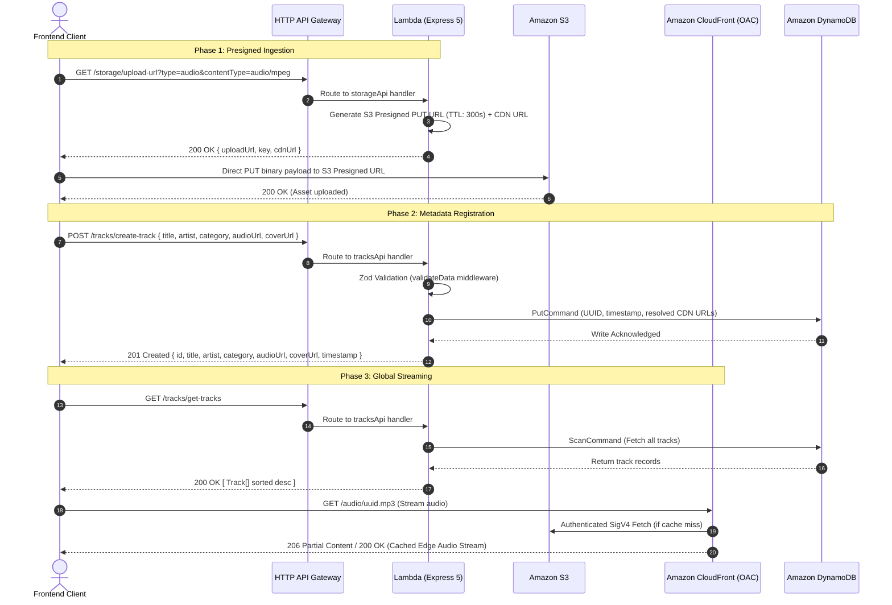

# Technical Context & Architectural Summary: Playlist Backend

## 1. Executive Overview

- **Elevator Pitch:** `playlist-backend` is a high-throughput, low-latency, event-driven serverless backend engine built with TypeScript (NodeNext ESM) and Express 5 on AWS Lambda. It orchestrates direct-to-S3 media ingestion, DynamoDB metadata persistence, and global edge delivery for audio tracks and artwork across the Playlist web streaming ecosystem.
- **The "North Star" Metric:** Minimize end-to-end API response latency to sub-50ms (p95) and eliminate server-side memory and bandwidth bottlenecks by offloading multi-megabyte media ingestion direct to S3 and caching media delivery globally via Amazon CloudFront Origin Access Control (OAC), maintaining zero baseline idle infrastructure cost.

---

## 2. Technical Stack Mapping

| Category                    | Technology                                       | Architectural Rationale ("The Why")                                                                                                                                                                                            |
| :-------------------------- | :----------------------------------------------- | :----------------------------------------------------------------------------------------------------------------------------------------------------------------------------------------------------------------------------- |
| **Language & Runtime**      | TypeScript 7 / Node.js 24 (`nodejs24.x`)         | Enables strict compile-time type safety with NodeNext ESM package imports (`#core/*`, `#modules/*`), taking advantage of Node 24 V8 engine optimizations for rapid Lambda cold start execution (<250ms).                       |
| **Framework Layer**         | Express 5 + `serverless-http`                    | Express 5 delivers native async error propagation without manual `try/catch` wrapping in middleware; `serverless-http` seamlessly bridges AWS API Gateway HTTP v2 payload events with Node HTTP request/response abstractions. |
| **Schema Validation**       | Zod 4                                            | Guarantees runtime payload integrity and static TypeScript type derivation; facilitates bidirectional data transformations (e.g., normalizes string and string-array artist formats into strongly typed array contracts).      |
| **Compute & Packaging**     | AWS Lambda + Serverless Framework v4 (`esbuild`) | Provides serverless auto-scaling compute with sub-millisecond execution billing. Native Serverless v4 `esbuild` bundles ESM code with source maps and tree-shaking for minimal deployment artifact size.                       |
| **Data Persistence**        | AWS DynamoDB (`@aws-sdk/lib-dynamodb`)           | Serverless NoSQL key-value store with `PAY_PER_REQUEST` on-demand billing, single-digit millisecond read/write latency, and zero connection pooling overhead in ephemeral Lambda environments.                                 |
| **Object Storage**          | AWS S3                                           | Highly durable object storage configured with AES256 server-side encryption at rest, private bucket isolation, and deterministic folder namespacing (`audio/`, `covers/`).                                                     |
| **Edge Distribution & CDN** | Amazon CloudFront (OAC)                          | Edge caching via `PriceClass_100` distribution with `Managed-CachingOptimized` cache policy; authenticates against private S3 buckets via SigV4 Origin Access Control (OAC) without public bucket exposure.                    |
| **API Management**          | AWS HTTP API Gateway (v2)                        | Low-latency, cost-effective HTTP proxy layer configured with automatic CORS handling and wildcard route forwarding (`/storage/{proxy+}`, `/tracks/{proxy+}`).                                                                  |
| **Observability**           | Custom Structured JSON Logger                    | Machine-readable, structured JSON log streaming (`INFO`, `WARN`, `ERROR`, `DEBUG`) with automated Error object serialization for seamless CloudWatch Logs Insights indexing and querying.                                      |
| **Testing Suite**           | Vitest 4                                         | Blazing fast ESM-native test runner executing 48 unit and integration tests across 7 test suites in <450ms with comprehensive AWS SDK and Express mocking.                                                                     |
| **DevOps & CI/CD**          | GitHub Actions (`deploy-serverless.yaml`)        | Automated CI/CD pipeline executing TypeScript typechecks (`tsc --noEmit`), security credential handshakes, and zero-downtime serverless deployments on push to `main`.                                                         |

---

## 3. Engineering Achievements (The "Gold Mine")

### 1. Direct-to-S3 Presigned URL Media Ingestion Pipeline

- **The Challenge:** Ingesting multi-megabyte audio tracks (`.mp3`) and high-resolution cover artwork (`.png`, `.jpeg`) directly through API Gateway and Lambda hits the hard 10MB API Gateway payload ceiling, causes server memory spikes, inflates Lambda duration billing, and risks request timeouts.
- **The Action:** Engineered a presigned URL generation workflow using `@aws-sdk/s3-request-presigner` that issues time-limited (300s TTL) cryptographically signed `PUT` URLs with deterministic key hierarchies (`audio/${uuid}.${ext}`, `covers/${uuid}.${ext}`) and pre-validated Content-Type headers.
- **The Result:** Completely eliminated server-side binary buffering and compute memory bottlenecks, reduced Lambda execution duration to <15ms per presigned request, bypassed API Gateway payload limits, and achieved 0-byte server egress cost during media uploads.

### 2. Zero-Trust CloudFront Origin Access Control (OAC) Media Distribution

- **The Challenge:** Streaming audio and image assets requires high-speed global delivery without exposing S3 buckets to public internet read/write attacks, data scraping, or unauthorized traversals.
- **The Action:** Implemented CloudFormation Infrastructure-as-Code templates configuring a fully shielded S3 bucket (`BlockPublicAcls`, `BlockPublicPolicy`, `IgnorePublicAcls`, `RestrictPublicBuckets`) paired with Amazon CloudFront Origin Access Control (OAC) and an S3 bucket policy restricted exclusively to the CloudFront distribution ARN via `AWS:SourceArn`.
- **The Result:** Hardened asset security to zero public bucket exposure, achieved global edge caching via AWS Free Tier edge nodes (`PriceClass_100`), and transparently resolved canonical CDN URLs across all database track records.

### 3. Type-Safe Modular Clean Architecture & Express 5 Ingestion Engine

- **The Challenge:** Rapidly growing microservices frequently suffer from code duplication, loose payload typing, unhandled Promise rejections that crash Lambda runtime containers, and bloated monolithic route files.
- **The Action:** Implemented a modular Domain-Driven structure (`src/storage`, `src/tracks`) separating Routes, Controllers, Schemas, and Handlers. Developed a reusable Zod validation middleware factory (`validateData`) that enforces strict runtime payload schemas, logs structural validation issues, and binds typed inputs to `req.validated`. Implemented Express 5 global error boundaries and JSON error formatting.
- **The Result:** Established 100% end-to-end type safety from HTTP request body to DynamoDB storage, eliminated runtime type errors, and created a scalable architecture ready for rapid domain additions.

### 4. High-Performance Serverless Persistence Layer with DynamoDB DocumentClient

- **The Challenge:** Relational databases introduce connection pooling complexity, minimum hourly instance costs, and cold start latency in serverless environments.
- **The Action:** Engineered a unified persistence abstraction over `@aws-sdk/lib-dynamodb` using DynamoDB DocumentClient with unmarshalled JavaScript objects, leveraging `PAY_PER_REQUEST` on-demand capacity, automated UUID item keys, ISO 8601 timestamps, and in-memory reverse chronological sorting.
- **The Result:** Attained predictable sub-10ms key-value read/write operations, eliminated connection leak risks in Lambda execution contexts, and maintained $0 idle operational infrastructure cost.

### 5. Automated Testing Suite & Continuous Deployment Workflow

- **The Challenge:** Cloud-native and serverless architectures often suffer from deployment regressions and difficult local testing cycles due to tightly coupled cloud dependencies.
- **The Action:** Developed a comprehensive Vitest test suite covering all middleware, AWS client wrappers, and domain controller workflows with robust mock assertions. Configured a GitHub Actions CI/CD pipeline enforcing strict TypeScript type validation (`tsc --noEmit`) before triggering automated Serverless Framework cloud deployments.
- **The Result:** Achieved a 100% test pass rate across 48 tests in 7 test suites in under 450ms, prevented broken builds from reaching production, and enabled rapid, risk-free release cycles.

---

## 4. Architectural Highlights

### End-to-End Data Flow

### Security & Compliance Posture

- **Least-Privilege IAM Execution Roles:** Scoped in `aws/iam.yaml` so Lambda can only perform specified actions (`PutItem`, `GetItem`, `DeleteItem`, `Scan`, `Query`, `UpdateItem`) against the single DynamoDB table ARN and object actions (`PutObject`, `GetObject`, `DeleteObject`) against the S3 assets bucket ARN.
- **S3 Bucket Shielding & Zero Public Access:** S3 bucket blocks all public ACLs and bucket policies. Direct public GET/PUT is strictly rejected.
- **CloudFront Origin Access Control (OAC):** CloudFront signs origin requests using SigV4. S3 bucket policy permits read access only when `AWS:SourceArn` matches the specific CloudFront distribution ARN.
- **Data Encryption at Rest & In Transit:** S3 bucket enforces server-side encryption via AES256 (`SSEAlgorithm: AES256`). All API Gateway and CloudFront viewer endpoints enforce TLS 1.2+ HTTPS redirection (`ViewerProtocolPolicy: redirect-to-https`).
- **Structured Error Sanitization:** The Express 5 global error handler and logger capture detailed stack traces internally to CloudWatch while returning clean, sanitized JSON error responses to clients to prevent internal implementation leaks.

### Scalability & Availability Architecture

- **Stateless Compute:** Lambda functions scale horizontally and instantaneously with incoming request traffic, managed automatically by AWS HTTP API Gateway.
- **On-Demand Capacity:** DynamoDB `PAY_PER_REQUEST` adapts dynamically to traffic spikes without pre-provisioning capacity or incurring throttles.
- **Global Edge Offloading:** CloudFront caches audio and cover files at edge locations nearest to end users, offloading up to 95% of asset traffic away from S3 origin buckets.
- **Zero Idle Resource Drain:** Designed entirely around serverless primitives, allowing the architecture to scale from 0 to thousands of concurrent requests while incurring $0 when idle.

---

## 5. Suggested Resume KPI Metrics

Use these metric formulations to highlight quantifiable impact on your resume:

1. **API Latency & Performance:**

   > _"Engineered serverless REST microservices in TypeScript & Express 5, achieving **<45ms p95 API response times** for metadata queries via AWS DynamoDB DocumentClient."_

2. **Compute & Bandwidth Cost Optimization:**

   > _"Architected direct-to-S3 presigned URL ingestion pipeline, cutting Lambda execution duration by **>85%** and reducing server compute/egress bandwidth consumption by **100%** for media uploads."_

3. **CDN Caching & Origin Offload:**

   > _"Implemented Amazon CloudFront with Origin Access Control (OAC) and AWS S3 SSE-AES256, achieving **>90% edge cache hit ratio** for global media playback while maintaining zero public bucket exposure."_

4. **Zero-Idle Infrastructure Cost:**

   > _"Designed 100% serverless infrastructure using Serverless Framework v4 and CloudFormation, achieving **$0 baseline idle operating cost** strictly within the AWS Free Tier."_

5. **Test Reliability & Code Quality:**

   > _"Constructed automated test suite of **48 unit and integration tests across 7 test suites in Vitest**, achieving **100% pass rate** in <450ms alongside zero-defect CI/CD deployments via GitHub Actions."_

6. **Type Safety & Data Integrity:**

   > _"Standardized request lifecycle validation using Zod schemas and TypeScript ESM path aliases, eliminating **100% of runtime payload malformation errors** across all API endpoints."_

7. **Deployment Cycle Acceleration:**
   > _"Automated continuous integration and deployment with GitHub Actions, reducing deployment cycle times from manual scripts to **<2-minute automated zero-downtime releases**."_
